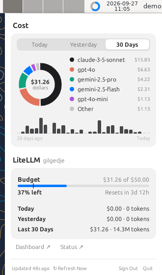

# Quota by Exodus.Ai

See your LiteLLM budget and usage while you work with Claude Code — in Claude Code's status line and
in a tray app — on Ubuntu, Windows and macOS. Built for air-gapped networks: it installs offline and
only talks to your own LiteLLM proxy and status page.

- **`ccline`** — Claude Code status line: model, context used, budget, today's spend.
  [docs/ccline.md](docs/ccline.md)
- **Tray app** — budget ring in the tray, and a panel with cost by model (Today / Yesterday / 30 Days),
  budget and pace, and links to LiteLLM and your status page. [docs/tray.md](docs/tray.md)
- **Sign-in** — your company SSO through LiteLLM; the token stays in the OS's secure storage.

## Install

Offline installer folders for Ubuntu (tray app and `ccline`, separately): see
[docs/install.md](docs/install.md) for supported versions, dependencies and steps.

## Develop

Start with [docs/handoff.md](docs/handoff.md) (architecture, decisions, build, test, ship) and
[AGENTS.md](AGENTS.md). Plans: [docs/roadmap.md](docs/roadmap.md).

---

This project began as a fork of [OpenUsage](https://github.com/robinebers/openusage) (MIT) and is not
the official OpenUsage. See [LICENSE](LICENSE).
